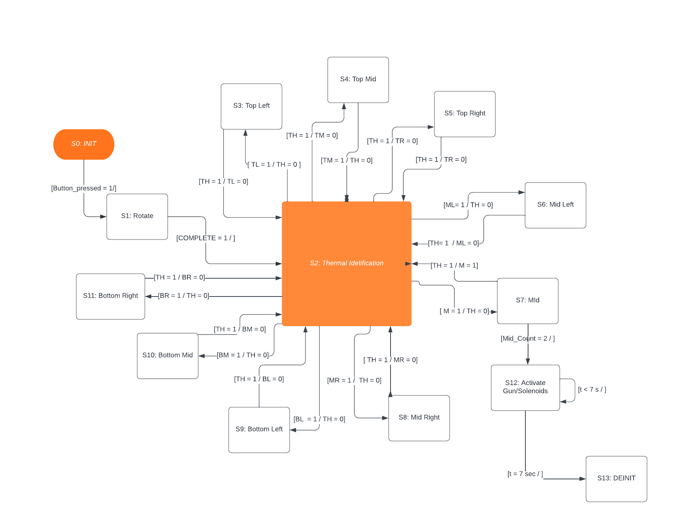

# Term Project Overview
Names: Connor Dilloughery, Erik Torres - Mech Tub 16

## Introduction
The purpose of this project is to create an automatic nerf gun that is fully self-automated. We created this device as apart of our ME 405 Term Project, 
which consists of code we've written over the quarter. This design is intended for anyone who likes to channel their inner-child self and want to blast 
someone which nerf darts without pulling a trigger. Our design consists of four motors, a themal camera, and a solenoid. We controlled two of the motors 
apart of this design in order to provide a yaw and a pitch rotation. The other two motors are apart of a nerf gun kit that accelerate two flywheels that 
provides the force to launch the darts. We also used a thermal camera so that the system could recognize where someone is based on the hightest temperature 
readings. Within our thermal system design, we are setting the yaw and pitch to a desired angle to position the gun in the direction of the person. In 
order to load a dart into the gun, we used a solenoid that pushes the darts in the spinning flywheels. To make the project more fun, we decided to make 
our gun fully automatic, launching 15 darts within 2 seconds by retracting and pushing the solenoid fifteen times.

## Hardware Overview
The hardware on apart of the design are as listed:
  - Nucleo STM 32L476
  - X-Nucleo-IHM04A1 Motor Driver
  - MLX 90640 
  - Metek motors (2)
  - Worker motors (2) 
  - Solenoid
 
As mentioned before, we only had to parameterize the Metek motors because controlling the motor position and speed was necessary. Using the MLX camera, the output from the device was split into a 3x3 grid to help center the camera at the location with the highest heat density. Two Metek motors were used to operate the pitch and yaw of the system. Given that there were 5 seconds from the initial turn-on period, a more accurate positioning system was opted for instead of doing a fast system. The gear ratio that was chosen for the project was a 16:1 gear ratio for both the yaw and the pitch. Combined with the gear ratio already installed internally within the motor, the final drive ratio was 256:1. This large gear reduction allowed for a full cycle to have an encoder count of about 200,000 ticks. This larger accuracy and slower travel were deemed as the better approach as it would allow for less overshoot and allow for the system to stop travel midway through after having received a new frame. With the opponent having to stop at the end, speed was not a priority throughout the concept of this device. 
Once the Metek motors aligned the turret with the target, the hardware associated with the shooting mechanism was triggered. A pair of 132 motors by Worker were fitted into an aluminum flywheel cage with canted flywheels, which was also produced by the worker. Upon finishing ramp-up, a 12v solenoid is able to rapidly actuate to deliver the darts to the flywheels. 

### Full Design 

This shows the overall design of the turret. A lot of the parts were opted to be made out of wood to prevent using 3d printing for everything. The only things that were 3d printed were the gears for the drive system, magazine holder, and motor holder. While the entirety of the design could have been 3D printed, in an effort to spend more time in the shop/using tools, the decision was made to make almost every piece of wood. Pictured Below as some images of the whole design after it was built. There are some components missing such as the camera and motors as they were taken off but clear locations for motors are present. The camera was placed on the shaft, using a piece similar to the motor holders. 

### Flywheel and Solenoid Mechanism
The actuation as previously described utilizes a solenoid pushing a dart into the flywheel. While there is nothing complex about the setup, the design approach was chosen for successful fire and space-saving configuration. Pictured below is the setup. 

### Gear System Overview
The most intricate pieces of this design were the two gearboxes that were used to drive the system. An initial design led to the whole device has a large gear reduction due to the possible weight that it would have. Upon further testing, it was not required but proved to be helpful in controlling the yaw and pitch to pinpoint locations. With a limited refresh rate from an unoptimized camera code for higher refresh rates, the slower turning allowed for greater control in our direction as needed. 
#### Yaw Drive System 
The first drive system that was created was the yaw drive system. This was the most critical as the base would need a 270-degree range at the most. An input gear attached to the motor is the driving gear. Each driven/driver gear is a couple between a large and small gear to allow for rigid attachment but the free spin on the shaft it is located on. The only shaft that is glued to the gears is the last shaft that connects the bottom gear system to the top system which rotates a central gear attached to the base. Pictured below are models of the design and the real-world build of such a system.

#### Pitch Drive System 
Similar to the drive system located beneath the entire device, the pitch system has the same gear ratio but a different arrangement. Upon actual creation of the device, the gear ratio was decreased by removing 2 gears, resulting in a 4:1 ratio. Below are pictures of the concept design as opposed to the gear ratio actually implemented for the yaw system.

## Software Overview
In make our software, we imported the following code: 
  - motorDriver.py
  - encoder.py
  - MotorControl.py
  - mlx_cam.py 
  - calibration.py
  - image.py
  - regmap.py
  - utilts.py
  - __init__.py

To make our code, we used finite state machines to tell the code which state to run. See the attached image below to see the finite state diagram:

 
 In our main file, we used four different functions:
  - main(): This function includes all of the finite states and calls neccessary functions to run our hardware. 
  - task1_Motor(): This function is called when the yaw motor is required to move to a new position. It checks to see if the encoder value is
    near the desired position.
  - task2_Motor(): Performs the same task as task1_Motor(), but is used for the pitch motor. 
  - fire(): The fire function gets called when it's time to turn on the gun motors and activate the solenoid. It cycles through, turning the solenoid 
    off and on. 
    

 To make our thermal camera funcitonal for our code, we created a 3x3 matrix with the following purpose:
  - Top Left
  - Top Middle
  - Top Right 
  - Middle Left
  - Middle (Perfect)
  - Middle Right
  - Bottom Left
  - Bottom Middle
  - Bottom Right

When the thermal camera produced temperature readings, we cycled through the array looking for the largest value and its index. We used the index to determine the matrix position, which would give desired encoder postions to send to the motor function. 

To make our motors functional, we inputted a desired encoder positon value. We also assigned a proportional constant on the motor to tell our motor how fast to run. We used our code from Lab 2 to drive our motor. 
    
 The link to find these functions are: [Code Overview](https://connordilloughery.github.io/Term_Project_Website/main_8py.html)
 
 Although the mechanical design did not work in the end, we were able to get the positional motors, thermal camera, gun, and solenoid working. As apart 
 of our demonstration, we should off the fully automatic setting of our gun. 
 
 To test our model, we first tested the thermal camera. We had one member hold up the thermal camera while the other stood ~10 feet away. We oriented 
 the camera to see it the member was being read by the camera. 
 
## Results
The system was tested as it was built. Some devices/actions were not tested until the very end but each system was tested individually to see how it was working. Being that the entire device was built of wood and tolerances caused by our cuts/holes, there was a lot more that could go wrong. Within testing, a lot of this was apparent but we made do with what we had to fix the design on. Below are the different tests performed in no particular order. 

### Testing Firing Mechanism
The very first mechanism that was tested was the firing mechanism. The reason that this was the first device to be tested was that it was the simplest to get up and running after being built. It did not rely on any other device. There were some issues at first when getting the device running such as not having the correct mosfet and not sharing an equal ground. After figuring that all out, a simple code was put into the terminal to turn on each device in the order that they should. The firing rate was adjusted to see the time of travel required to have successful actuation and deliver the dart into the flywheels. 

### Testing Camera Detection
The camera was a bit harder to test initially when there were alignment issues with the base. The initial approach to test the device was to have the camera in a place and record the approximate angle that we were away from the center of the camera. With the code running, the camera would detect that we were nearby, sending a new theta value to be achieved by the motors. The theta value was taken from the print statement and then we determined if it was approximately the location that one of us was standing at relative to the center of the camera. We knew the number of ticks per full revolution which allowed a ballpark estimate of the theta value that should be given to get to the location. The testing with this method went well. The camera was allowed to run several times, reprinting the theta value that was recently calculated. Each time, the theta value was close enough that we considered the camera a success for the time being. 
Once there was more progress on the base, the camera was secured onto the shaft of the flywheels. Motors were placed within the spots on the turret and the program was allowed to run and detect us. There were major flaws with the device's ability to rotate as the central gear began to skip and was ultimately unaligned. After fixing the alignment issues by changing the location where the wood dowels were bolted down, the code was allowed to run again. The next issue that arose was that with the new location of the dowels, the bearing that supported the base was not properly turning. There was a lot of resistance to turn that the motors would have trouble turning the shaft and instead translate the centerpiece. 

### Testing Pitch Drive System
The pitch system was not a big concern. The inertia of the motor and the gear reduction was large enough to allow for the pitch to remain unchanged while off. 
To test the pitch system, a simple code that changed the pitch by 10 degrees in either direction continuously was run. There were no issues with the actuation other than the gear sometimes popping off but this was later fixed by gluing a cap onto the rod. 

### Testing Yaw Drive System 
Testing the yaw system was similar to testing the pitch system. The yaw was set to rotate approximately 180 degrees and then rotate back and forth by 90 degrees. This would allow us to confirm that the base had the full range of travel that would be required to successfully turn around and track opponents. When the code began to run, the first second or so was hopeful. The issues happened with the alignment of the central gear. It was not properly aligned. When it was realigned, there was a large resistance present by the bearing, possibly due to being angled or bent. It was hard to rotate past a certain point with the motor and would require us to move it by hand. The yaw remained to have issues throughout further testing, more will be explained on that later. 

### Testing System
When the entire system was put together, the code was ran. Every component was working correctly except for the base as previous trials suggested. the base was unable to turn the full extent without stalling or skipping due to the large resistance within the bearing. We moved in front of the turret to continue with testing as the base could not turn to see us. Once we were within the center, the code kept running as it should have and excuted the list of commands that it had. 

## Improvements and Lessons Learned
There was a lot that was learned about this project when undergoing it. It was an amazing opportunity to be able to combine different types of work/structures into one. With limited time in the shops for any school projects recently, we wanted to get more experience building something that was made of wood. The idea was really great at first but it soon snowballed as we found ourselves unable to make it to any time the shop was open. Whether it was work, classes, or the weather, it was hard to be free and on campus before 4/5 pm every day. There was a day or two in which we were able to but there was not enough time to do everything that we had to. A lot of the building came down to hand tools. A lot of the pieces were cut by hand using saws and drills. The drills were used to bore holes but also used to create an outline of the shape we wanted to cut. While this helped reduce cutting effort, it gave us ragged edges. The edges were not important to functionality but definitely did affect the overall appearance of the device. 
Another lesson that was learned during the building was the importance of tight tolerances and making sure that all pieces were cut properly before being assembled. With most pieces being cut by hand, there were slight angles that were sanded out. With all being a visual indicator as opposed to true measurements, some alignment had t be fixed during assembly. This did not go too well when it came to building the base, the most crucial part of the entire project. 
Nearing the end, some problems were ignored due to having already spent a lot of money on the project and sourcing components that we tried to make do with what we had. Although we tried, there were some issues that couldn't be completely overcome such as the resistance in the base. Everything else worked as it should have but the base could have had a better design as opposed to the design that was created. 
Moving forward from this project, a better and simpler approach would have been to 3D print the crucial parts and also keep it compact due to the more precise and small part capabilities of a 3D printer. While we had access to one 24/7, we did not choose to undergo that route and instead spent a lot more hands-on time trying to troubleshoot and craft new parts. To improve upon the design, the gear ratio would be reduced to 4:1 and the overall size would be greatly reduced using 3d printed parts as there is no need for large forces as all the parts used were light in nature. 
A lot of the parts worked as the should have but sadly the base was the part that didn't work and ended up causing problems for the rest since it was the highest on the hierarchy list. If the base couldn't rotate, nothing else could undergo their intended routines. 
